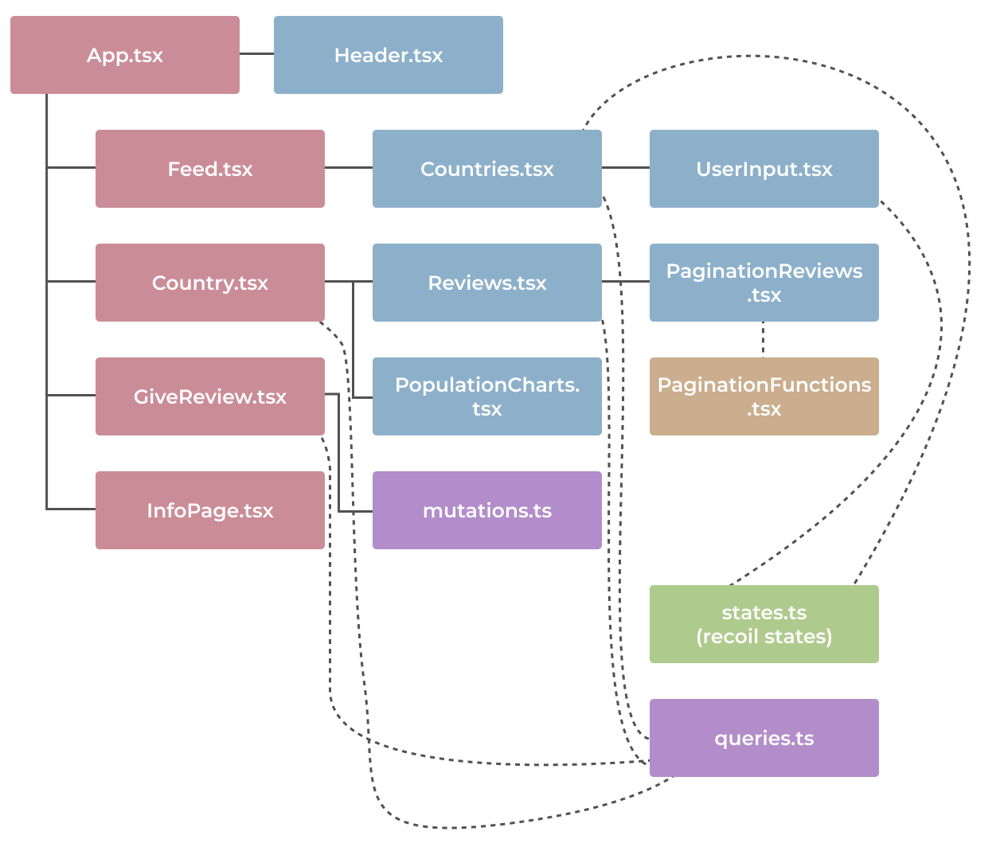

# Project 3 - Envisionary
Welcome to our project, Envisionary. Envisionary allows the user to make informed choices about their next travel destination through viewing information and reviews from other travellers about the world’s countries. The users of Envisionary are encouraged to write their own reviews on countries they have visited. For ease of use, Envisionary’s data can be filtered in several ways; both by searching for countries and continents and by hiding unreviewed countries. The countries can also be sorted from A-Z or Z-A on both countries and continents.

Our project is powered by MongoDB, Apollo, TypeScript React and Node.js. Because our Apollo server also uses Express under the hood, our project ends up with a *MERN* stack. Additionally, we have used Mongoose, the component library Material UI, recharts for charts, recoil for global state management and React Router DOM for routing between pages in a SPA friendly way. For querying the database, we have used GraphQL. Lastly, we have tested with Jest, React Testing Library and Cypress.

## 🎉 Running the project
The project can be viewed and tested live on http://it2810-66.idi.ntnu.no/project3/. However, to run locally do the following:

1. Clone project
2. Open a terminal window, navigate to the backend folder and run `npm install` followed by `npm start`
3. In another terminal window, navigate to the frontend folder, then run `npm install` followed by `npm start`

Please contact a team member if you have problems running the project.

## 👨‍🏫 Running the tests

### Run unit tests:
1. Open a terminal window, navigate to the frontend folder and run `npm test a`

### Run end-to-end tests:
1. Run the project as described in [this section](#🎉-running-the-project)
2. Open a terminal window, navigate to the frontend folder and run `npm run cypress:open`. This will open cypress. 
3. When cypress has opened, click on "E2E Testing". And click "Start E2E Testing in Firefox" or "Start E2E Testing in Chrome". 
4. There are two end-to-end tests: "countries.spec.cy.ts" and "review.spec.cy.ts". Simply click one to make the test run. 

## 🌚 Backend
We used Apollo’s function *startStandaloneServer* to create our server in the backend. *startStandaloneServer* uses Apollo Server 4's Express integration, expressMiddleware, under the hood and we therefore did not have to configure Express ourselves (source [here](https://www.apollographql.com/docs/apollo-server/api/standalone/)). For communicating with our database, we used Mongoose.

## 🗃️ Database schema design
Though MongoDB has no hard rules for schema design, we decided to use some best practices when designing our schema. Because “data that is accessed together should be stored together” (source [here](https://www.mongodb.com/developer/products/mongodb/schema-design-anti-pattern-separating-data/)), we decided to only have one collection, “countries”,  and use denormalisation to embed an array of reviews on each country in the “countries” collection. That way, information about a specific country and the country’s belonging reviews can be accessed in a single query.

## 🧩 Components
We have six components: Header, Countries, PopulationChart, Reviews, ReviewsPagination and UserInput. These components are used in the pages of the site: Feed, Country, GiveReview and InfoPage. 
  * The Header contains the navbar on the top of the screen and contains all of the navigation to Feed (which contains the Countries-component), GiveReview and the InfoPage. 
  * The Countries-component shows the list of countries with pagination, the search bar where you can filter the list and a select box which will filter the list based on country names or continents. 
  * By clicking on one of the rows or countries in the list the user will be shown the Country page. This page contains more information about the specific country, the PopulationChart- and the Reviews-Component for that country with its ReviewPagination that ensures that reviews are shown using pagination if there are more than 3 reviews on a country.
  * The GiveReview page contains a combo box, input fields and a star rating where the user can give a review by selecting an existing country, write their names and give a rating from 0 to 5. 
  * The InfoPage contains general information about the website.

Below is an image of the component structure and how they interact with each other. Solid lines indicate that they are imported components. Dashed lines indicate that they have functions that are being used in the component, such as queries and mutations. The blue background color indicate that it is in the components folder, purple is the graphql folder, pink is the pages folder, green is the states folder, and the beige/brown is the utils folder.

## 🌐🤝 Global state management
We use Recoil to manage global states, as it was very easy to implement. In the beginning we considered Redux, but we realised that Redux is more suited for larger projects as read in this [source](https://www.imaginarycloud.com/blog/recoil-vs-redux/l).
Our recoil states are saved in the file states.ts in the frontend folder of the project, and it handles the state of the user search query, search category chosen by user, and the page location on the countries pagination.
"Props drilling" is often seen in projects with many components passing props to each other. By using recoil, we were able to limit our use of props, hence making the code easier to read and maintain.

## 💡💚 Sustainable web design
* Colour use
  * Our website generally has a bright design theme. For example a light blue colour is used as the background colour throughout the website. Bright colours need light, and therefore consume more energy. A darker colour theme would save energy, but would not fit our design. We therefore went with the bright colour theme.
* Movements in the website
  * We have a graph that shows the population through the years which has an animation when the user first enters the page. The links in the header and the rows in table also change colour each time the user hovers over them. These movements and interactions increase the energy use for the client. 
* Sustainable development
   * We use typescript as our programming language, and even though it is not one of the most energy-efficient programming languages, typescript is generally an energy-efficient programming language. 
   * Regarding our font use we have used the Roboto font which is fetched from outside. Built-in fonts would have used less energy than fonts that are fetched from outside.
   * We also use dynamically generating pages instead of static pages since the table with countries changes based on what the user has typed in the search bar. This makes the site more flexible and interactive but the energy consumption will therefore be higher.
   * Big generic libraries like MUI, which is a component library, is used in frontend rather than just plain html and typescript. This in turn made the development of the site a lot easier since components didn’t have to be made from scratch and it saved time, but this would therefore also put a strain on the energy consumption since a lot of components in the library are never used.
   * In the future we have to be aware of the choices we make and design with energy-efficient solutions in mind that contribute to less consumption and pollution.
* Search, caching and pagination
  * Using Apollo's *InMemoryCache* our project caches results from the database so the same data is only fetched once
  * Pagination reduces the amount of information fetched from the database at once
  * Options for filtering and sorting the data makes it easier for the user to fetch the desired information using less resources

## 📄 Pagination
* We implemented offset based pagination using the Apollo Core Pagination API. The reason for this choice was that offset based pagination is less complex to implement than cursor based pagination. We also concluded that offset based pagination is acceptable in our case because the user is not given the opportunity to add or delete records (in our case, countries) to the dataset. As such, the offset will stay consistent and we do not risk some records being skipped or shown twice while the user switches between pages.
* Later in the project we realised that it would be beneficial to implement cursor based pagination instead, particularly in order to utilise the hasNextPage and hasPreviousPage properties when designing the navigation buttons for switching between pages. Currently the user is only given the option to jump back or forth one page at a time. 
* Because the main drawback to cursor based pagination is its added complexity, we do encourage future developers to make the switch to cursor based pagination in order to improve the user’s navigation choices and get a slight increase in performance (though the increase in performance might not be that noticeable since our dataset already is small).

## 🦽👁‍🗨 Web accessibility 
Contrasting colours on text and background elements helps users distinguish text from background. Maintaining this clear contrast makes our design accessible for users with impaired vision.
Pictures and elements that don’t have text should have alternatives which explains what is shown for screen readers. The star rating elements have for example a text alternative for each star. The population chart in the country page also has a text alternative.
Additionally, we have provided a visual label for each input element that conveys the purpose of the input form element for screen readers.

For our text input field we also provided a visually hidden element that can be read out loud by screen readers for visually impaired people or others who have a hard time reading as placeholder text inside text fields may be difficult for screen readers to read. That means it's not visible for users who do not use screen readers. All these elements are marked with the class-name “.visually-hidden” and we found the code at (source [here](https://www.emgoto.com/react-search-bar/)).

Icons may seem common sense to many, but for some they may be confusing (source [here](https://uxdesign.cc/ux-of-the-hamburger-menu-890328a904f9)). Few icons thus improves web accessibility. Keeping that in mind, we chose to have a navigation bar with buttons instead of a "hamburger" menu.

### Responsivity
Responsivity makes a product accessible for use on different devices. The team focused less on responsivity than the previous project, as responsivity was not explicitly mentioned as a requirement. However, we have ensured that the design is functional also on smaller screens, especially by using the sx prop on MUI components (Material UI) with breakpoints for xs (extra small), sm (small), md (medium), lg (large), and xl (extra large) screens. This was an easy way to maintain some degree of responsivity. Several components also use grids or flexboxes to ensure a flexible layout.

## 🧪 Testing
* We used Jest for unit testing, and Cypress for end-to-end testing. Mocking was used: for example, the recoil state using the searchQueryState atom in the UserInput component is mocked, making it possible to test that typing triggers onInput. There are snapshot tests and tests that check that components contain the right elements with correct values. 
* The unit tests are somewhat limited due to time constraints and challenging dependencies between components. Also, the fact that Enzyme is dead (and not supported for react version 18.x) makes unit tests particularly challenging (source [here](https://dev.to/wojtekmaj/enzyme-is-dead-now-what-ekl)). Unfortunately this means that individual components are not tested as thoroughly as we wished, but we believe that the end-to-end tests ensure that our app works properly, at least from the perspective of an end user. We think it would make sense in reality, given more time, to make up for it with integration tests with better use of the React Testing Library. 
* We made two end-to-end tests: One that navigates the countries page, and one that tests the “give review” page:
* The former switches pages, searches on country and continent (including searching a nonsensical country, which should yield no results), opens multiple countries and checks that the information on screen is correct. This tests that the application works as intended even when the user navigates back and forth, throughout the entire sequence of actions. 
* The latter checks validation thoroughly by attempting to submit a review without entering or picking the required information, expecting error messages to prompt the user. It then enters all the required information and submits a review, and finishes by opening the country in question and ensuring that the review exists.
